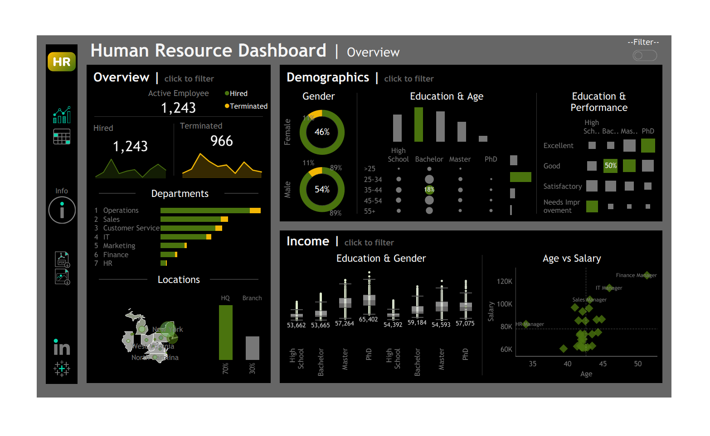
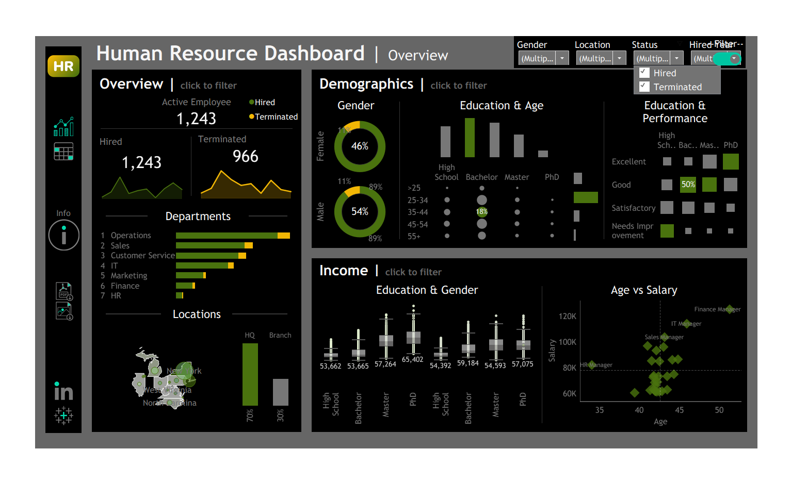
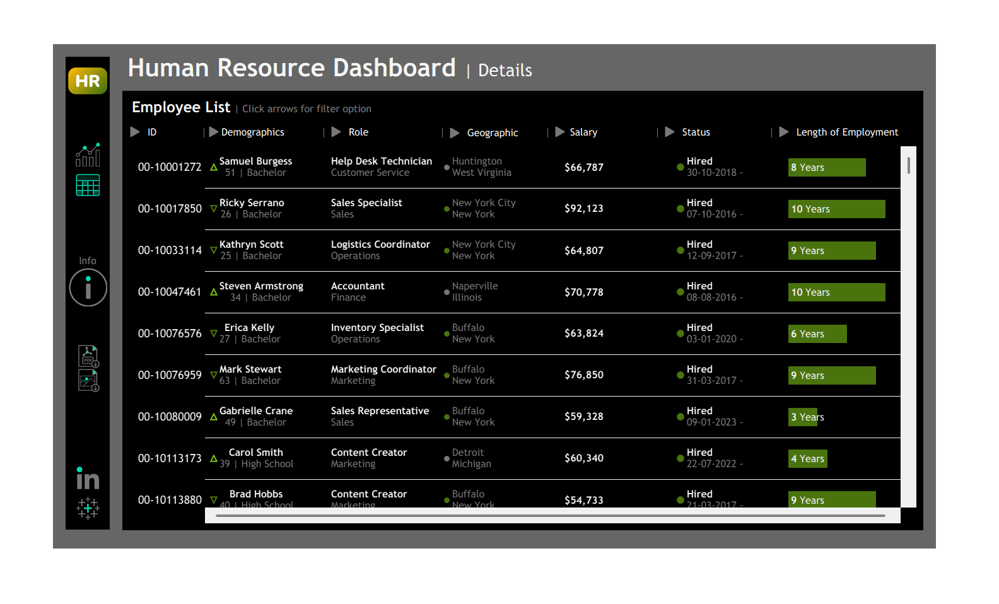
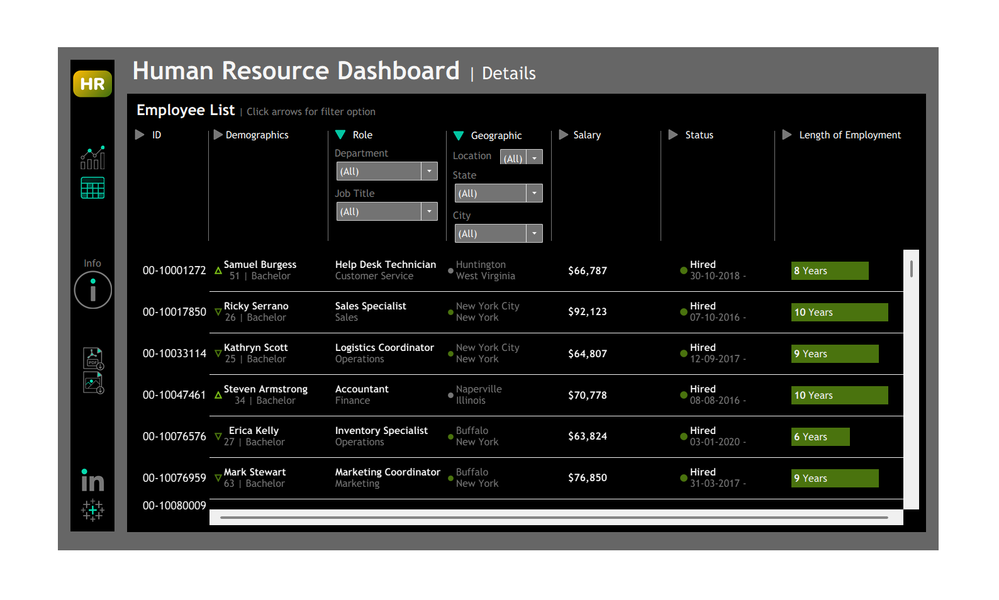
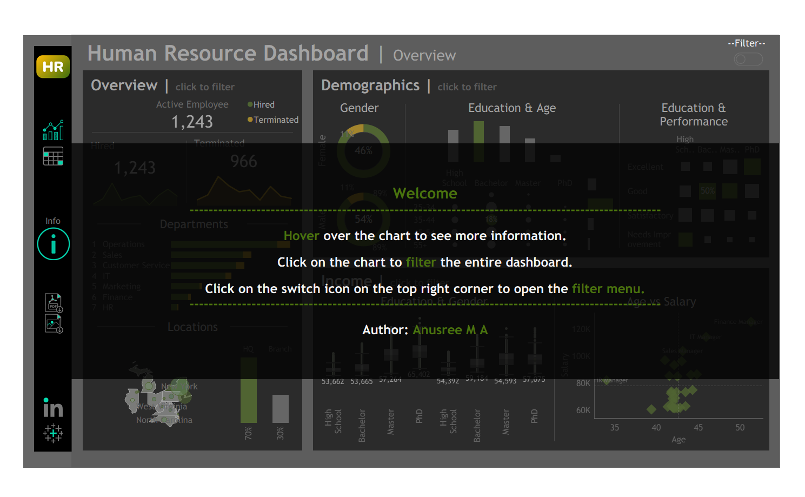

# 📊 Human Resource Analytics Dashboard | Tableau

<p align="center">

</p>


---

## 📌 Project Overview

This Human Resource Analytics Dashboard was developed using Tableau to provide a comprehensive analysis of workforce demographics, employee distribution, salary trends, educational background, performance evaluation, and employment status.

The dashboard enables HR professionals and business leaders to analyze employee patterns, identify workforce trends, monitor organizational health, and support strategic decision-making through interactive visualizations.

---

## 🎯 Business Objectives

- Analyze workforce demographics and employee distribution.
- Monitor employee hiring and termination trends.
- Evaluate department-wise workforce allocation.
- Understand salary patterns across age and education levels.
- Analyze employee performance by educational background.
- Explore geographic distribution of employees.
- Support data-driven HR decision-making.

---

## 🛠️ Tools & Technologies

| Tool | Purpose |
|------|---------|
| Tableau Desktop | Dashboard Development |
| CSV Dataset | Data Source |
| Tableau Public | Dashboard Publishing |
| GitHub | Project Hosting |
| Data Visualization | Business Intelligence |

---

## 📈 Key Performance Indicators

- Active Employees
- Total Hired Employees
- Total Terminated Employees
- Employee Gender Distribution
- Department Distribution
- Education Level Analysis
- Salary Analysis
- Employee Performance Analysis
- Employment Duration Analysis

---

# Dashboard Pages

## 1️⃣ HR Dashboard Overview

The overview dashboard provides a high-level summary of workforce metrics.

### Features

✔ Active employee count  
✔ Hired vs terminated employees  
✔ Department distribution  
✔ Geographic employee distribution  
✔ Gender demographics  
✔ Education analysis  
✔ Salary analysis  
✔ Employee performance analysis

<p align="center">

</p>

---

## 2️⃣ Interactive Filtering Dashboard

The dashboard contains interactive filters allowing users to explore workforce trends dynamically.

### Available Filters

- Gender
- Location
- Employee Status
- Hired/Terminated Status

<p align="center">

</p>

---

## 3️⃣ Employee Details Dashboard

This dashboard provides detailed employee-level information.

### Features

✔ Employee demographics  
✔ Department information  
✔ Job role analysis  
✔ Geographic details  
✔ Salary details  
✔ Employment status  
✔ Employment duration

<p align="center">

</p>

---

## 4️⃣ Employee Detail Filtering

Users can filter employee records using multiple dimensions.

### Filter Categories

- Employee ID
- Department
- Job Title
- Location
- State
- City
- Employment Status

<p align="center">

</p>

---

## 5️⃣ Dashboard Information Page

An integrated information page guides users through dashboard interaction.

### Instructions Included

- Hover to view details
- Click charts to filter
- Use dashboard filters
- Navigate between dashboard pages

<p align="center">

</p>

---

# 📊 Key Insights

### Workforce Distribution
- Operations department contains the largest workforce.
- HR department contains the smallest workforce.

### Employee Demographics
- Male employees account for the majority of the workforce.
- Bachelor's degree holders represent the largest educational segment.

### Salary Analysis
- Salary tends to increase with experience and management roles.
- Finance and IT managers receive the highest compensation.

### Employee Performance
- Higher education levels correlate with improved performance ratings.

### Geographic Analysis
- Employee concentration is highest in New York and surrounding states.

---

# 🚀 Dashboard Features

- Interactive filtering
- Dashboard actions
- Dynamic visualizations
- Cross filtering
- Drill-down capability
- Employee search
- Geographic analysis
- Responsive dashboard design

---

# 📂 Repository Structure

```text
HR-Analytics-Tableau-Dashboard/
│
├── HR_Dashboard.twbx
├── dataset.csv
├── README.md
├── LICENSE
│
└── assets/
    ├── HR-Overview.png
    ├── HR-Filter.png
    ├── HR-Details.png
    ├── HR-Detail-Filter.png
    └── HR-Info.png
```

---

# ▶️ How to Run

### Option 1 — Tableau Public

View the interactive dashboard here:

🔗 https://public.tableau.com/views/HR_Dashboard_17829309017640/HR

🔗 https://public.tableau.com/views/HR_Details/HR

---

### Option 2 — Tableau Desktop

1. Clone this repository.
2. Open `HR_Dashboard.twbx`.
3. Verify the data source connection.
4. Explore the interactive dashboard.

---

# 🔗 Project Links

### Tableau Public

- HR Dashboard Overview:
  
  https://public.tableau.com/views/HR_Dashboard_17829309017640/HR

- HR Employee Details:

  https://public.tableau.com/views/HR_Details/HR

### LinkedIn

- https://linkedin.com/in/anusree-ma

---

# 👩‍💻 Author

## Anusree M A

Aspiring Data Analyst | Tableau Developer | Business Intelligence Enthusiast

### Skills

- Tableau
- Power BI
- SQL
- Python
- Data Analytics
- Business Intelligence
- Dashboard Design

---

## ⭐ If you found this project useful, please consider giving it a star.
